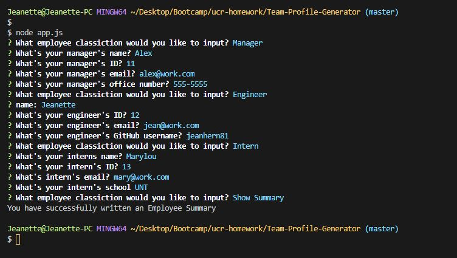
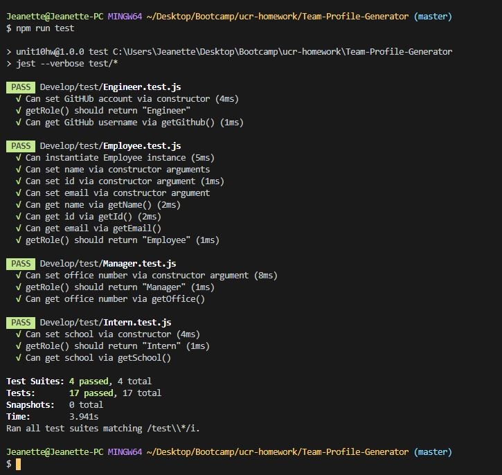

# Employee Profile Generator

---

# Demo 

---

# Description

This Node CLI application is a great tool to easily create HTML pages that will display employees basic contact informaton. The application will prompt you a series of questions about your team members. Enter the data for each member of your team. Once the data is entered, select `Show Summary` to complete the usage of the application. An HTML is then genearted with contact cards for each member of your team.

---

# Demo 

<a href="https://drive.google.com/file/d/1u8dA3MlEfGi8dAThzW93VSZMrZoKBeJ1/view?usp=sharing">Click Here</a>

--- 

# Test

run test in node by typing in npm run test

